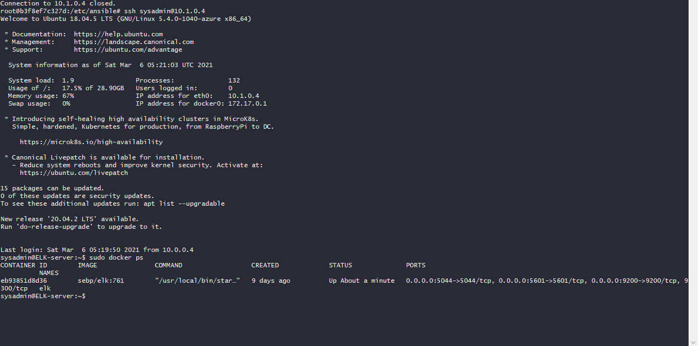

## Automated ELK Stack Deployment

The files in this repository were used to configure the network depicted below.

These files have been tested and used to generate a live ELK deployment on Azure. They can be used to either recreate the entire deployment pictured above. Alternatively, select portions of the playbook file may be used to install only certain pieces of it, such as Filebeat.

  - elk-playook.yml

This document contains the following details:
- Description of the Topologu
- Access Policies
- ELK Configuration
  - Beats in Use
  - Machines Being Monitored
- How to Use the Ansible Build

### Description of the Topology

The main purpose of this network is to expose a load-balanced and monitored instance of DVWA, the D*mn Vulnerable Web Application.

Load balancing ensures that the application will be highly avaible, in addition to restricting access to the network.

Integrating an ELK server allows users to easily monitor the vulnerable VMs for changes to the log files and system performance.

The configuration details of each machine may be found below.

| Name     | Function | IP Address | Operating System |
|----------|----------|------------|------------------|
| Jump Box | Gateway  | 10.0.0.1   | Linux            |
| Web-1    | VM       | 10.0.0.7   | Linux            |
| Web-2    | VM       | 10.0.0.6   | Linux            |
| Web-3    | VM       | 10.0.0.8   | Linux            |
| ELK VM   | ELKStack | 10.1.0.4   | Linux            |

### Access Policies

The machines on the internal network are not exposed to the public Internet. 

Only the Jump Box machine can accept connections from the Internet. Access to this machine is only allowed from the following IP addresses:
- 205.197.212.156 

Machines within the network can only be accessed by Port 22.
- 10.0.0.1

A summary of the access policies in place can be found in the table below.

| Name     | Publicly Accessible | Allowed IP Addresses |
|----------|---------------------|----------------------|
| Jump Box | No                  | 10.0.0.1 10.0.0.2    |
| DVWA-VMS | No                  | 10.0.0.1             |
| Elk Stack| No                  | 10.0.0.1             |

### Elk Configuration

Ansible was used to automate configuration of the ELK machine. No configuration was performed manually, which is advantageous because there is less room for error and this same script can be re-used on multiple machines.

The playbook implements the following tasks:
- Install Docker.io
- Install Python3-pip
- Install docker python module
- Download and launch a docker elk container

The following screenshot displays the result of running `docker ps` after successfully configuring the ELK instance.

### Target Machines & Beats
This ELK server is configured to monitor the following machines:
- 10.0.0.6
- 10.0.0.7
- 10.0.0.8

We have installed the following Beats on these machines:
- filebeat-7.6.1-amd64.deb

These Beats allow us to collect the following information from each machine:
- Filebeat monitors and collects log events on specified servers, then it sends these log files to Kibana

### Using the Playbook
In order to use the playbook, you will need to have an Ansible control node already configured. Assuming you have such a control node provisioned: 

SSH into the control node and follow the steps below:
- Copy the filebeat_configuration.yml file to the ELK VM.
- Update the hosts file to include 10.0.0.6, 10.0.0.7, 10.0.0.8
- Run the playbook, and navigate to Kibana (PUBLIC_IP:5601) to check that the installation worked as expected.
